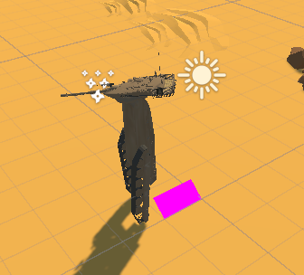

# DH2323 Project
## Transforming the tank into a robot
This project extends lab 3 of the animation track and consists of rotating and scaling different parts of the tank into a walkable robot. The rotations were made using the RotateAround function and the translations using the Lerp function (linear interpolation).

## Process

#### May 13th
Working on making the wheels and body rotate. They did not rotate in the same direction because of local coordinate axes.

#### May 14th
Added all parts into their corresponding lists for easy access when rotating and translating the different parts. Halted input while transforming.

#### May 15th
Correct rotation of the body and wheels have been implemented.

#### May 16th
Finished project. Fixed correct translation of body and turret. Made the legs swing back and forwards when walking. Screenshot of finished robot:  
  
[Finished project demo](https://drive.google.com/file/d/1_e8OWIV822ACsRMCcvrLO8qy93UF26i5/view?usp=sharing)