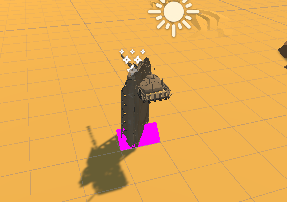

# DH2323 Project
## Transforming the tank into a robot

#### May 13th
Working on making the wheels and body rotate. They did not rotate in the same direction because of local coordinate axes.

#### May 14th
Added all parts into their corresponding lists for easy access when rotating and translating the different parts.

#### May 15th
Correct rotation of the body and wheels have been implemented.

#### May 16th
Finished project. Fixed correct translation of body and turret. Made the 